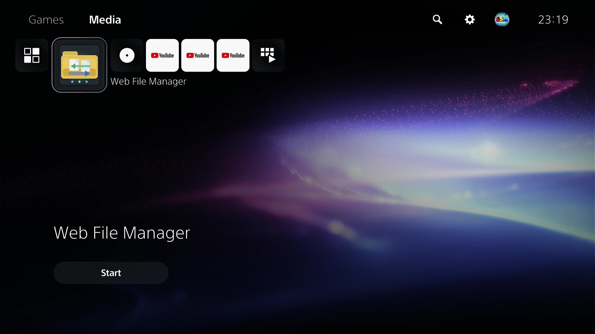
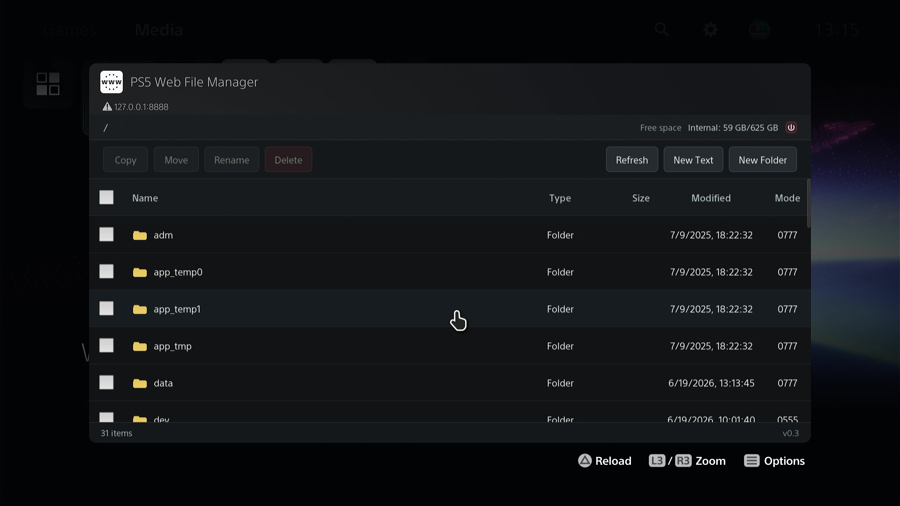
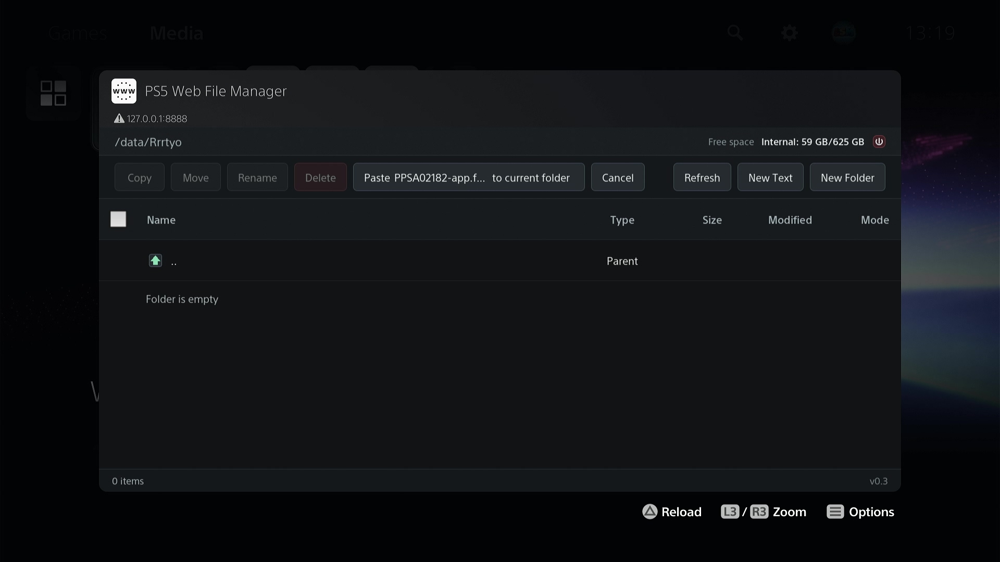

<div align="right">
  <a href="README.md">English</a> · <a href="README.zh-CN.md">简体中文</a>
</div>

# PS5 Web File Manager

> Homebrew HTTP file manager for jailbroken PS5 consoles. Browse, edit, upload, download and extract ZIPs through any browser on the same network — single self-contained ELF payload, no external services, no telemetry.

**Version:** v1.9.3M · **Title ID:** `FMGR88888` · **License:** GPLv3+ · **Target:** `x86_64-sie-ps5`

---

## Overview

A payload ELF that runs an HTTP file manager inside a jailbroken PS5. Open `http://<PS5_IP>:8888/` from any browser on the LAN — including the PS5 browser itself — to manage files on attached USB storage and the user partition. Designed for safely copying game-dump folders from USB to internal storage, but it also handles general file management, in-place text editing, PKG preview/install, image preview, and ZIP extraction with built-in zip-bomb protection.

The same source tree builds a Linux binary for development and a PS5 payload ELF for deployment — see `make linux` below.

## What's new in v1.9.3M

- **Encrypted ZIP extraction works end to end** — both schemes:
  - traditional PKWARE ("ZipCrypto", what `zip -e` writes), and
  - WinZip AES-128/192/256 (compression method `99` plus the `0x9901` extra
    field, what `7z -mem=AES256` and WinZip write), for stored and deflated
    entries.

  A missing or wrong password is reported as `extract_password` — the code the
  task overlay already knew how to translate, even though until now nothing
  could produce it for a ZIP. The SHA-1,
  HMAC-SHA1 and AES primitives live in a new local minizip-ng backend,
  `third_party/minizip-ng/src/mz_crypt_wfm.c` (PBKDF2 comes from the vendored
  `mz_crypt.c`); its header explains why they are implemented in-tree instead
  of delegating to another vendored library.
- **Encrypted RAR is actually wired up.** v1.9 vendored an engine that *could*
  decrypt (`RARSetPassword`) but never called it, so encrypted archives were
  rejected. The password now reaches the engine, including for `-hp`
  header-encrypted archives, and a wrong password returns `extract_password`
  so the prompt can retry.
- **Build fix: compiler-flag changes now invalidate objects.** `make` cannot
  see flag changes, so adding `-DHAVE_WZAES -DHAVE_PKCRYPT` left the existing
  `mz_zip.o` / `mz_crypt.o` in place — and because nothing referenced the new
  streams any more, `--gc-sections` quietly dropped the encryption code again
  while the link still "succeeded". The Makefile now records the third-party
  flag set in `ps5-obj/.third_party_cflags` and rebuilds only when it really
  changes. This is the same trap the `LzmaDec.o` rule was working around.
- **The UI can now retry with a password.** An `extract_password` failure no
  longer ends in an error box: the attempt is re-sent with whatever the user
  types, up to three times, keeping the conflict policy and the large-file
  opt-in of the original request. Cancelling or submitting an empty box falls
  back to the original failure report. 7z keeps its up-front prompt, since an
  encrypted 7z header would otherwise cost a wasted scan.
- **Encrypted 7z headers (`-mhe=on`) now open.** This was the last known format
  gap: with `-mhe=on` the file names, the folder table *and* every entry size
  sit inside the encrypted header, so the vendored SDK gives up with
  `SZ_ERROR_UNSUPPORTED` before it can list a single entry. A new module,
  `src/sevenz_header.c`, reads the header record, decodes its one folder with
  the project's own 7zAES path (`src/sevenz_chain.c`) and then hands the SDK a
  small virtual stream in which the encrypted record has been replaced by the
  plaintext — so the SDK goes on parsing exactly the archive it always did, and
  nothing on disk is touched. Archives whose header is merely *compressed*
  (`-mhc=on`, the default) are not modified in any way, and a wrong password
  comes back as `extract_password` like every other encrypted archive.
- `tests/make-zip-enc-fixtures.bat` and three real fixtures under
  `tests/fixtures-real/` (`enc-zipcrypto.zip`, `enc-aes256.zip`,
  `enc-aes256-store.zip`, password `secret123`).
- Host checks: **140 ZIP + 37 RAR = 177** (`tests/run-tests.sh`). The new
  encrypted-ZIP cases run against real archives in `tests/fixtures-real/`
  generated by the new `tests/make-zip-enc-fixtures.bat`.
- A RAR archive that asks for a dictionary larger than this build supports no
  longer reports as a per-entry size problem: it gets its own
  `extract_dict_too_large` code and a message that names the required and the
  supported dictionary size. The build's behaviour is unchanged — such an
  archive is still refused, because honouring it would mean allocating the
  whole window in one shot, which is exactly what rarlab's own CLI refuses to
  do by default and what a 16 GB shared-memory console cannot afford.
- 7z checks: **27 cases, 0 failures** (`tests/run-sevenz-tests.sh`), and the
  `KNOWN_GAPS` list that held `aeshe` is now empty — the encrypted-header
  fixture passes through both the folder decoder and the extraction facade.
- The frontend retry flow has a headless check of its own —
  `node .build/ui_retry_test.mjs` loads the real `assets/main.js` into a stubbed
  DOM and asserts the remembered request, the retry cap and the give-up paths,
  including the regression case for a non-ASCII folder: **40 checks, 0 failures**.
  `node .build/ui_upload_menu_test.mjs` covers the markup side — every
  `data-i18n` key exists in both languages, the upload menu is wired to the
  right handlers, the classes it uses are styled, and the row-highlight rules
  are scoped so they cannot lose the cascade to a generic button rule, and that
  the extract button is never hidden — only disabled, with a message per reason:
  **40 checks, 0 failures**.
- The tree builds to **903 448 B**, sha256
  `8ca47d5aaca75085b32641300cce30fadb7df7749cb6b53d04f129bcecc286b7`,
  `e_machine` `0x003e`. Rebuilt from the same tree, byte-identical both times;
  the built ELF was checked to contain the new frontend code, which is only
  reachable after gunzipping the embedded assets. Same 20 sections and **no new
  dynamic symbols**. The encrypted-archive work added +5 712 bytes of content
  (`.text` +4 880, `.rodata` +640, `.eh_frame*` +192); the fork marker below
  then added a further +0x100 (256 B), the corrected
  `err_extract_unsupported` copy another +0x40 (64 B), the upload menu +0x980
  (2 432 B), the frontend copy and CSS of the first fix round +0x100 (256 B)
  and the scoped row-highlight rules +0x180 (384 B), then the always-on extract
  button +0x240 (576 B) — every one of them to
  `.rodata` **and to no other section**, so the file is still 903 448 B across
  all six builds. An unchanged size is not evidence of an unchanged binary —
  compare sections with `readelf -SW`.
- **The version string carries a fork marker: `v1.9.3M`.** Upstream releases are
  plain `vX.Y.Z`, so the trailing `M` (Modified) is what tells you which of the
  two projects a build came from. It is part of `VERSION_TAG`, so `/api/version`,
  the PS5 start-up notification, the stdout banner, the UI footer and the ELF
  file name all carry it at once, and the UI footer spells it out on hover. The
  file name changing also means a fork build can no longer shadow an upstream
  artifact of the same upstream version. See Credits.
- Validated end to end on a real console before release.

> This section describes **v1.9.3M**, which is released:
> <https://github.com/LisherSong/ps5-web-file-manager/releases/tag/v1.9.3M>.
> The previous release, `v1.9.2`, contains none of it.

## What's new in v1.9.2

Version-string-only re-release. The `v1.9.1` tag sat four commits behind the
tree that produced its binary, so the tag could not rebuild the published
artifact; v1.9.2 is cut from the right commit. It is functionally identical to
the v1.9.1 binary — the only change is the baked-in version string.

## What's new in v1.9

- **RAR engine replaced with the official rarlab UnRAR 7.20.1**
  (`third_party/unrar7/`, replacing dmc_unrar). This is what actually
  makes RAR extraction work on real files: dmc_unrar could not decode
  archives written by **WinRAR 6.x/7.x** (RAR5 "v6" compression) and had
  no multi-volume support — both now work.
- **RAR5 "v6" archives extract** (the v1.8-era "corrupt archive" report
  on WinRAR 6/7 files is gone).
- **Multi-volume RAR** (`.part01.rar` chains): unrar stitches the parts by
  name when the full set sits next to the volume you open.
- Engine can decrypt encrypted RAR (`RARSetPassword`) — password UI /
  API plumbing still pending, encrypted archives are rejected for now.
- Host tests now run real archives (v6 / encrypted / 3-volume fixtures
  committed under `tests/fixtures-real/`): **70 ZIP + 24 RAR = 94 checks**.

## What's new in v1.8

- **Single-volume RAR extraction** via the vendored FLOSS library
  [`dmc_unrar`](https://github.com/DrMcCoy/dmc_unrar) (GPL-2.0-or-later).
  RAR 1.5, 2.x, 3.x, 4.x and 5.x archives are supported. `.rar` files
  appear in the file list with the **Extract** button enabled; the button
  is greyed out on `.part02+.rar` sub-volumes with the tooltip "select
  the main volume instead" — v1.8 cannot stitch multi-volume RARs (see
  the [RAR extraction](#rar-extraction) section below).
- **Shared extraction protocol** between the new `src/rar_extract.c`
  engine and the existing `src/zip_extract.c` engine: same `zipx_status_t`
  codes, same `zipx_limits_t` profile (default / `large=1`), same
  three-phase model (`scan → extract → publish → cleanup`), same staging
  directory layout, same conflict policy, same error mapping into the
  task UI. The dispatcher in `src/extract.c` is one tiny
  `ends_with_ci(…)` switch.
- **14 new host-side C tests** (`tests/test_rar_extract.c`) wired into
  the existing `tests/run-tests.sh`. Coverage: format dispatch, error
  translation across every `DMC_UNRAR_*` code that affects RAR users,
  limit-profile handoff. Total host checks: **69 ZIP + 14 RAR = 83**.
- **Documentation**: [`CHANGELOG.md`](./CHANGELOG.md),
  [`docs/UPGRADE-v1.8-rar-support.md`](./docs/UPGRADE-v1.8-rar-support.md)
  and the vendoring decision tree at
  [`third_party/unrar7/VENDORED.md`](./third_party/unrar7/VENDORED.md)
  (v1.8 shipped it as `third_party/unrar/VENDORED.md`).
- See the [dedicated section](#rar-extraction) below for scope and the
  limitations that come from using dmc_unrar (no multi-volume, no
  encryption in v1.8 — both lift in v1.9 when the library is replaced).

## What's new in v1.8.1

- **Default ZIP limits relaxed** (companion to v1.7's large profile).
  v1.7 shipped with a 64 GiB default per-entry cap, which was too
  aggressive for typical PS5 system-backup ZIPs (200-300 GiB). v1.8.1
  raises the default profile to **1 TiB total / 256 GiB per entry /
  500 : 1 ratio**, with the `large=1` opt-in kept at 2 TiB / 1 TiB /
  1000 : 1. The frontend threshold rises from 60 GiB to 240 GiB so
  common system-backup archives no longer trigger the prompt.
- RAR extraction inherits the new defaults (rar_extract.c threads
  `c->limits` from the engine — no engine change required).
- Rationale: the real zip-bomb defence is `check_space()` (statvfs-based
  real disk-space check before staging) + `max_ratio` (declared
  compression ratio cap). The size caps are a UX guard, not a security
  boundary.

## What's new in v1.8.2

- **Default ZIP limits relaxed again** for the 3A-game single-file case.
  A single ~300 GiB uncompressed file inside an archive was still
  silently rejected by v1.8.1 (the default scan returns
  `ZIPX_ERR_LIMIT_FILE_SIZE` before the request ever reaches the
  frontend confirmation prompt). v1.8.2 raises the default profile to
  **2 TiB total / 512 GiB per entry / 500 : 1 ratio**, with the `large=1`
  opt-in bumped to 4 TiB / 1 TiB / 1000 : 1. Frontend threshold rises
  from 240 GiB to 480 GiB.
- **Two PS5-only build fixes** discovered when cross-compiling for the
  PS5 target. The host-side test suite (`tests/run-tests.sh`) had
  silently accepted both because it links the same sources but uses
  gcc rather than clang 18 and a different include path:
  - `Makefile` CFLAGS: add `-Ithird_party/unrar` so `src/rar_extract.c`
    can find the project-authored `dmc_unrar_api.h` facade header.
  - `src/extract.c`: move `extract_progress()` definition above
    `extract_dispatch()` so the implicit function declaration is not
    flagged by `-Werror=implicit-function-declaration` (clang 18 in the
    PS5 SDK is stricter than the host gcc used by tests).
- **Release artifact** for v1.8.2: `web-file-mgr.elf` — 509 704 bytes,
  sha256 `1b2c3d68b35e32737105f17d14a80a3c159ceca0cabd274ee168cbcd81906f65`,
  ELF class 64, little-endian, e_machine `0x003e` (x86_64-sie-ps5).
- Tests: **84 host-side checks** (70 ZIP + 14 RAR), 0 failures. PS5
  cross-compile succeeds end-to-end.

## What's new in v1.7

- **ZIP large-file profile** (opt-in via the new `large=1` argument on `/api/extract`): relaxed caps of **2 TiB** archive total, **1 TiB** per entry, **1000 : 1** compression ratio. The frontend prompts for confirmation whenever the archive on disk is larger than **60 GiB**; the server only activates the profile when the user explicitly agrees.
- **Stricter default ZIP profile** stays safe: **1 TiB** total / **256 GiB** per entry / **500 : 1** ratio. A 4 MiB compressed payload that expands to 800 GiB still gets rejected before any output file is opened.
- **69 host-side C tests** (`tests/run-tests.sh`) now cover path traversal, ZIP64, encryption rejection, ratios, conflict policies and the new large-file profile (`tests/test_zip_extract.c`).
- Earlier refinements — see `git log` since v1.6.

## Screenshots

<p>
  <a href="docs/screenshots/20260617_231827.376.jpg" target="_blank"></a>
  <a href="docs/screenshots/20260619_131432.399.jpg" target="_blank"></a>
  <a href="docs/screenshots/20260617_232348.855.jpg" target="_blank"></a>
  <a href="docs/screenshots/20260619_131811.644.jpg" target="_blank"></a>
  <a href="docs/screenshots/20260619_131535.239.jpg" target="_blank"></a>
  <a href="docs/screenshots/20260620_232728.533.jpg" target="_blank"></a>
</p>

## Features

- **Browse** — list files and folders; sort by name, type, size, mtime or permissions. Last sort mode persists in `localStorage`.
- **Permissions** — toggle read/write/execute with checkboxes, or paste a validated four-digit octal mode.
- **Operations** — copy, move, delete (recursive, no recycle bin), rename, create files and folders.
- **Editor** — in-place UTF-8 text editor for files ≤ 1 MiB across a curated extension list: `.txt .json .xml .ini .cfg .conf .md .log .lua .js .css .html .htm .c .h .cpp .hpp .sh .csv .yaml .yml .shn`.
- **Multi-select** — copy, move, delete or tar-download many items in one go.
- **Upload** — single files or folder trees from any device on the LAN (hidden in the PS5 browser). Atomic temp + rename.
- **Download** — single file as raw bytes, or folders/multi-select as a streaming `.tar`. Hidden in the PS5 browser.
- **Tasks** — full-screen overlay with delayed show, live progress, throughput, ETA, cancel, and recovery if the browser is closed and reopened mid-task.
- **Archive extraction** — ZIP, RAR and 7z, all behind the same zip-bomb / traversal / ratio protection. ZIP covers stored / deflated / ZIP64 plus **encrypted** entries (ZipCrypto and WinZip AES-128/192/256); RAR covers RAR4 + RAR5 including WinRAR 6/7 "v6", multi-volume, and `-p` / `-hp` encryption; 7z covers Copy / LZMA / LZMA2 / PPMd, the Delta and BCJ2 filters, `.7z.001` volumes, 7zAES, and `-mhe=on` encrypted headers. See the [ZIP extraction](#zip-extraction) and [RAR extraction](#rar-extraction) sections below for scope.
- **Encrypted archives** — a wrong or missing password is reported as `err_extract_password` and retried through a password prompt, up to three times, with the original conflict policy and large-file opt-in preserved. 7z asks for the password up front instead, so an encrypted header does not cost a wasted scan.
- **PKG** — install and preview `.pkg` files.
- **Images** — preview `.png .jpg .jpeg .gif .bmp .webp`.
- **Localization** — English + Simplified Chinese, auto-selected from `navigator.languages`.
- **Mobile-friendly** — responsive layout with wrapped toolbars and horizontally scrollable file lists.

## Quickstart

1. **Build** the ELF:

   ```sh
   export PS5_PAYLOAD_SDK=/opt/ps5-payload-sdk   # see "Build" for SDK setup
   make
   ```
2. **Send** the payload to the PS5 (default ELF-loader port `9021`):

   ```sh
   nc -q0 "$PS5_HOST" 9021 < web-file-mgr.elf
   ```
3. **Read** the on-screen PS5 notification — it prints the actual listen port (default `8888`).
4. **Open** `http://<PS5_IP>:<port>/` in any browser on the same LAN — the PS5 browser works too.
5. On first run, the payload also writes a **Media**-category home-screen launcher; existing launcher files are not overwritten.

## Build

Requires [ps5-payload-dev/sdk](https://github.com/ps5-payload-dev/sdk#quick-start):

```sh
export PS5_PAYLOAD_SDK=/opt/ps5-payload-sdk
```

This project links against `libmicrohttpd`. `make` checks for it before building and runs the installer automatically when missing:

```sh
make
```

If the build host has no network access, drop the libmicrohttpd tarball in advance and run the installer manually:

```sh
LIBMICROHTTPD_TARBALL=/path/to/libmicrohttpd-1.0.1.tar.gz \
  ./install-libmicrohttpd.sh
make
```

Output:

```text
web-file-mgr.elf   (~several hundred KiB, larger in v1.9 with unrar; x86_64-sie-ps5)
```

For pure UI/JS work without the PS5 toolchain:

```sh
make linux
./web-file-mgr-linux
```

The Linux build does **not** include the PS5 home-screen launcher installer.

## Usage

Start an ELF loader on the PS5 (port `9021` is common). Send the payload:

```sh
export PS5_HOST=ps5_ip_address
nc -q0 "$PS5_HOST" 9021 < web-file-mgr.elf
```

After the payload starts, the PS5 notification shows the app name, version and actual listen port. Open the URL it prints, for example:

```text
http://${PS5_IP_ADDRESS}:8888/
```

If the payload had to fall back to a different port (e.g. `8889`), use whatever port the notification shows — the URL is not hard-coded.

On first startup, the payload installs a `PS5 Web File Manager` shortcut in the Media category when needed. Existing launcher files are preserved; only missing ones are written.

## ZIP extraction

Plain and encrypted ZIPs — stored / deflated / ZIP64, in the clear or with either encryption scheme (traditional PKWARE "ZipCrypto" and WinZip AES-128/192/256). The engine is a standalone three-phase module (`scan → extract → publish → cleanup`) at `src/zip_extract.{c,h}`, with a separate host-side C test suite. Each entry is first written into a staging directory (`*.wfm-part-*`), then atomically renamed into the destination. There is deliberately **no per-entry `fsync`** anywhere in the extract path — the whole pipeline is "sync nothing, rename everything", because publish is rename-only and there is no resume feature to protect (measured ≥14x on an 8000-file archive; see `docs/EXTRACTION-PERF.md`). Any failure mid-archive rolls back partial changes; cancel and fatal errors always clean up staging.

### Limits

| Limit | Default profile | Large profile (`ZIPX_LIMITS_LARGE`) |
|---|---|---|
| `max_entries` | 200 000 | 500 000 |
| `max_total_bytes` (uncompressed) | 2 TiB | 4 TiB |
| `max_file_bytes` (per entry) | 512 GiB | 1 TiB |
| `max_ratio` (uncompressed / compressed) | 500 : 1 | 1000 : 1 |
| `max_depth` (folder nesting) | 32 | 32 |
| `max_name_len` / `max_path_len` | 255 / 1024 | 255 / 1024 |

The **default profile** is shipped safe: a 4 MiB compressed blob that decodes to 800 GiB is rejected before any output file is opened. The **large profile** is engaged **only** when the request includes `large=1` — the archive dialog prompts the user automatically whenever the archive on disk is larger than `LARGE_FILE_THRESHOLD_BYTES` (480 GiB by default; configurable in `assets/main.js`). Confirming the prompt is the user's explicit opt-in; the server still records nothing extra on its own.

### Security checks

The engine refuses to extract:

- Path traversal (`..` segments, absolute POSIX paths, Windows drive letters).
- Symbolic links, devices, FIFOs, sockets (`ZIPX_ERR_SPECIAL`).
- Duplicate entries or directory/file name clashes inside the same archive.
- Archives whose expanded size, entry count, depth, name length or compression ratio breach the active profile.

Encrypted entries are no longer a refusal: the password arrives as `password=`
on `/api/extract`, and a missing or wrong one comes back as `ZIPX_ERR_PASSWORD`
(`err_extract_password` in the UI) so the prompt can retry. The scan phase still
runs for encrypted archives — handing over a password does not skip the limits.

### Conflict policy

Passed as `conflict=` on `/api/extract`:

- `fail` (default) — refuse to overwrite any existing target.
- `overwrite` — replace existing files; merge into existing folders.
- `merge` — keep existing files, add new ones.

### Tuning the threshold

The 480 GiB frontend threshold lives in `assets/main.js`:

```js
const LARGE_FILE_THRESHOLD_BYTES = 480 * 1024 * 1024 * 1024;
```

Set it to `Infinity` to silence the prompt, lower it to be more conservative, or remove the call entirely — the server still respects `large=1` regardless of the threshold.

## RAR extraction

A RAR extraction engine (`src/rar_extract.{c,h}`) backed by the **official
rarlab UnRAR source** (`third_party/unrar7/`, version 7.20.1, compiled as a
static library and driven through its C-compatible DLL API). Files with the
extension `.rar` get the same **Extract** button as `.zip` files; the engine
is dispatched by `src/extract.c` based on extension.

> v1.9 replaced the v1.8 engine (dmc_unrar 1.7.0). dmc_unrar could not
> decode archives written by WinRAR 6.x/7.x (RAR5 "v6" compression) and had
> no multi-volume support; unrar handles both natively.

### Scope

| Format | Support | Notes |
|---|---|---|
| RAR 1.5 → 4.x (incl. 2.9 / 3.6 / 4.0) | ✅ | |
| RAR 5.0 and **5.0 "v6"** (WinRAR 6.x / 7.x) | ✅ | The v1.9 trigger |
| Solid blocks, dictionary up to 1 GiB | ✅ | |
| PPMd decompression (RAR 3.0+) | ✅ | |
| **Multi-volume** (`.part01.rar` + `.part02.rar` + …) | ✅ | unrar stitches parts by name when the whole set sits next to the volume you open. Select the first volume (`name.part1.rar` / `name.part01.rar`); non-first volumes are still greyed out in the UI with a hint. |
| **Encrypted RAR** | ✅ | Both `-p` data encryption and `-hp` header encryption. The password reaches the engine as `password=` on `/api/extract` (`RARSetPassword` runs after `RAROpenArchiveEx` and before the first `RARReadHeaderEx`); a missing or wrong one returns `ZIPX_ERR_PASSWORD` so the prompt can retry. |
| Symbolic links / FIFOs / sockets / devices | ❌ | Rejected with `ZIPX_ERR_SPECIAL` (mirrors ZIP behaviour) |
| RAR 1.3 (pre-1.4) | ❌ | Rejected upstream by unrar |

When an archive is rejected, the user gets an `extract_unsupported`
failure with the file name as the detail argument. The frontend already
shows this with the typical bilingual retry guidance.

### Limits

The RAR engine re-uses the ZIP limits table verbatim — there is no RAR
profile table on top. Defaults and the `large=1` opt-in are identical:

| Limit | Default profile | Large profile (`large=1`) |
|---|---|---|
| `max_entries` | 200 000 | 500 000 |
| `max_total_bytes` (uncompressed) | 2 TiB | 4 TiB |
| `max_file_bytes` (per entry) | 512 GiB | 1 TiB |
| `max_ratio` (uncompressed / compressed) | 500 : 1 | 1000 : 1 |
| `max_depth` (folder nesting) | 32 | 32 |
| `max_name_len` / `max_path_len` | 255 / 1024 | 255 / 1024 |

Large-profile RAR extraction uses the same `LARGE_FILE_THRESHOLD_BYTES`
(480 GiB) prompt as ZIP — the frontend treats `.rar` and `.zip` the same
way for the prompt, and the server only ever activates the large caps
when the request carries `large=1` (opt-in).

### Security checks

The RAR engine applies the same checks as the ZIP engine — re-uses
`zipx_status_t` codes, so the task UI's `err_extract_unsafe_name`,
`err_extract_too_deep`, `err_extract_ratio`, etc. all fire identically:

- Path traversal (`..` segments, absolute POSIX paths, Windows drive
  letters, `\` treated as a path separator after a `Rar!\x1a\x07…`
  header, etc.).
- Symbolic links, FIFOs, sockets, devices.
- Duplicate entries or directory/file name clashes inside the archive.
- Archive size, entry count, depth, name length or compression ratio
  breaches of the active profile.

### Vendoring and licence

`third_party/unrar7/` is a verbatim copy of the official **rarlab UnRAR
source** (7.20.1), mirrored by
[`opello/unrar`](https://github.com/opello/unrar) at commit `97e1780`. It is
distributed under the **UnRAR freeware licence** (see
`third_party/unrar7/license.txt`): it may be used in any software to handle
RAR archives, but may not be used to develop a RAR-compatible *archiver* or
re-create the RAR compression algorithm. The project-authored facade
`third_party/unrar7/unrar_c_api.h` carries the project's own licence.

> The v1.8 engine `third_party/unrar/dmc_unrar.c` (DrMcCoy/dmc_unrar 1.7.0,
> GPL-2.0-or-later) was removed in v1.9; its notice lives in git history.

### Encrypted RAR

The password channel is complete: `password=` on `/api/extract` is handed to
the engine, and `RARSetPassword` runs after `RAROpenArchiveEx` and before the
first `RARReadHeaderEx` — the order unrar needs to decrypt a `-hp` header. A
missing or wrong password comes back as `ZIPX_ERR_PASSWORD`
(`err_extract_password` in the UI), which is what raises the password prompt
and re-sends the original request, up to three times.

## 7z extraction

The 7z engine (`src/sevenz_extract.{c,h}`) is built on the LZMA SDK decode
subset plus the project's own pull-based codec chain
(`src/sevenz_chain.c`). Files ending in `.7z` get the same **Extract** button as
`.zip` and `.rar`; `src/extract.c` dispatches by extension, and the engine
re-uses the same three-phase model, limit profiles and conflict policy.

> Added in v1.9.1. The SDK's own `SzArEx` path only understands folders with up
> to four coders, which cannot express BCJ2's five — hence the self-parsed
> folder table and the pull-based chain.

A note on the header. 7-Zip keeps the archive header at the end of the file and
compresses it when it grows (`-mhc=on`, the default), which is why the header
region normally starts with an `k7zIdEncodedHeader` record describing one
folder. With `-mhe=on` that folder is *also* encrypted, and since it holds the
file names, the folder table and every entry size, the vendored SDK gives up on
the whole archive before listing anything. `src/sevenz_header.c` handles that
case: it reads the record, decodes its folder through the same 7zAES path the
content uses, and then presents the SDK with a virtual stream whose header
region is the plaintext — the archive on disk is never written to, and an
archive whose header is merely compressed is not touched at all.

### Scope

| Format | Support | Notes |
|---|---|---|
| Copy / LZMA / LZMA2 (incl. ZIP64-style sizes) | ✅ | A single-coder pure-LZMA2 folder decodes multi-threaded (`src/sevenz_mt.c`, 8 threads) |
| BCJ2 (x86 branch converter) | ✅ | Through the self-written chain; not expressible in the SDK's `SzArEx` |
| Multi-coder folders, Delta filter, PPC / IA64 / ARM / ARMT / SPARC converters | ✅ | Parsed by `src/sevenz_chain.c` |
| **Volumes** (`.7z.001` / `.z01` chains) | ✅ | `src/sevenz_volstream.c` stitches by name; open the first volume |
| **Content encryption** (7zAES, AES-256-CBC) | ✅ | The engine decrypts; the frontend asks for the password up front (so an unencrypted archive does not pay a wasted scan), passes it as `password=`, and retries on `ZIPX_ERR_PASSWORD` |
| **`-mhe=on` (encrypted header)** | ✅ | `src/sevenz_header.c` decodes the header record itself (through the same 7zAES path) and hands the SDK a virtual stream carrying the plaintext; a wrong password reports `ZIPX_ERR_PASSWORD`, so the prompt retries like any other encrypted archive |
| `-mhc=off` (uncompressed header) | ✅ | Plain headers were always readable; they are now read one byte at a time and left alone |

### Limits

The 7z engine re-uses the ZIP limits table verbatim — see
[ZIP extraction → Limits](#limits).

### Security checks

The same `zipx_status_t` codes and the same checks as ZIP and RAR: path
traversal, special files, duplicate/clashing entries, and size, entry-count,
depth, name-length or ratio breaches of the active profile.

## Verification

After `make`, sanity-check the produced ELF:

```sh
ls -la web-file-mgr.elf                            # size grew in v1.9 (unrar static library); ~509 KiB was v1.8.3
sha256sum web-file-mgr.elf                         # record the digest in your release notes
file  web-file-mgr.elf                             # expect "ELF 64-bit LSB pie executable, x86-64"
od -An -tx1 -N20 web-file-mgr.elf | head -2        # magic 7f45 4c46 0201 + e_machine 003e
```

The `e_machine = 0x003e` confirms the PS5 target triple `x86_64-sie-ps5`. The `e_type = 3` (`ET_DYN`) confirms the position-independent payload expected by ELF loaders.

## Tests

A POSIX/host-side C test suite covers the ZIP, RAR and 7z engines and runs on
any Linux / macOS / MSYS shell without the PS5 SDK:

```sh
cd tests && bash run-tests.sh          # ZIP + RAR suites
bash run-sevenz-tests.sh               # 7z suite (needs MinGW gcc + a 7-Zip binary)
```

Output is a per-case `check`-style report — **177 checks** on the current `main`
(140 ZIP + 37 RAR), 0 failures. Coverage:

- ZIP entry parsing (stored + deflated + ZIP64)
- Path traversal, absolute paths, backslash, Windows drive letters
- Symbolic links, FIFOs, bad CRC, truncated archives, non-ZIP files
- Limits: `entries`, `total_bytes`, `file_bytes`, `ratio`, `depth`, `name_len`
- Conflict policies: `fail` / `overwrite` / `merge`
- Cancellation in every phase
- **Encrypted archives** — each real fixture is run four ways (no password,
  empty password and wrong password → `ZIPX_ERR_PASSWORD`; correct password →
  success with a byte-level content check): `enc-zipcrypto.zip`,
  `enc-aes256.zip` and `enc-aes256-store.zip` on the ZIP side, `enc-v6.rar` on
  the RAR side. Two further cases prove the limits still apply once a password
  has been handed over, and that the failing paths publish nothing.
- **Large-file profile** — `medium_bomb.zip` (ratio ≈ 238) is rejected under default caps and accepted under large caps; lowered large caps still enforce.
- **RAR engine** (`tests/test_rar_extract.c`, 37 checks) — format
  dispatch (renamed ZIP rejected, junk blob rejected), error translation
  across every reachable engine code, limits handoff (the
  `large=1` opt-in flows into `rar_extract()` unchanged), the oversized
  dictionary path above, plus the real-archive coverage above.
- **7z engine** (`tests/test_sevenz_extract.c` + `tests/run-sevenz-tests.sh`) —
  byte-for-byte comparison against real `.7z` fixtures, encrypted-header
  rejection, conflicts under every policy, cancellation, limits, a missing
  destination parent, and the guarantee that a failure publishes nothing and
  cleans up its staging tree.

The frontend retry flow has its own headless check —
`node .build/ui_retry_test.mjs` loads the real `assets/main.js` into a stubbed
DOM and asserts the remembered request, the retry cap and the give-up paths:
**27 checks, 0 failures**. It lives in `.build/` (outside the gitignore
whitelist), so it is a development-time script rather than a committed test.

## Project layout

```
.
├── Makefile                      # PS5 + Linux builds (VERSION_TAG v1.9.3M)
├── install-libmicrohttpd.sh      # one-shot dependency installer
├── gen-asset-module.py           # embeds assets/* as gzip-compressed C arrays
├── assets/                       # HTML / CSS / JS / icons / param.json
├── src/                          # C payload sources
│   ├── main.c  websrv.c  filemgr.c        # entry, HTTP frontend, task model
│   ├── upload.c  download.c  text.c       # stream and in-place edit handlers
│   ├── extract.c                          # /api/extract dispatcher (ZIP + RAR + 7z)
│   ├── zip_extract.{c,h}  zipx_common.c   # ZIP engine (minizip-ng backend)
│   ├── zipx_volume.c  zipx_volstream.c    # ZIP volume detection + concatenating stream
│   ├── rar_extract.{c,h}                  # RAR engine (rarlab UnRAR 7.20.1 backend)
│   ├── sevenz_extract.{c,h}  sevenz_chain.{c,h}   # 7z engine, self-parsed codec chain
│   ├── sevenz_header.{c,h}                # 7z header reader / -mhe=on decryption
│   ├── sevenz_mt.c  sevenz_volstream.c    # multi-threaded LZMA2 + .7z.001 volumes
│   ├── app_installer.c  pkg_installer.c  pkg_info.c   # PS5 PKG preview / install
│   └── demangle_stub.c  cpu_support_stub.c            # size / portability stubs
├── third_party/                  # vendored libraries
│   ├── unrar7/                            # rarlab UnRAR 7.20.1 — RAR engine
│   ├── minizip-ng/                        # 4.2.2, trimmed to the read path
│   ├── 7z/                                # LZMA SDK 26.03 decode subset
│   └── zlib/                              # minizip's compression backend
├── tests/                        # POSIX/host test suite
│   ├── test_zip_extract.c  test_rar_extract.c  test_sevenz_extract.c
│   ├── sevenz_chain_e2e.c  sevenz_e2e.c  bigfile_e2e.c
│   ├── make_fixtures.py  make_sevenz_fixtures.py  make_split_fixtures.py
│   ├── run-tests.sh                       # one-shot runner (ZIP + RAR suites)
│   ├── run-sevenz-tests.sh                # 7z suite, carries the KNOWN_GAPS list
│   ├── bench_driver.py  bench_formats.py  # throughput benchmarks
│   ├── compat/                            # tiny Win32/MSYS shims
│   └── fixtures/  fixtures-7z/  fixtures-real/
├── docs/
│   ├── HANDOVER.md               # v1.8-era playbook, historical — see the root HANDOVER.md
│   ├── SIZE-OPTIMIZATION.md      # ELF size analysis + per-symbol ledger
│   ├── EXTRACTION-PERF.md        # decompression benchmarks
│   ├── REWRITE-FEASIBILITY.md    # engine-extraction study
│   ├── UPSTREAM-V1.8-COMPARISON.md
│   ├── UPGRADE-v1.7-zip-large-file-profile.md
│   ├── UPGRADE-v1.8-rar-support.md
│   └── screenshots/              # README screenshot images
├── THIRD_PARTY_NOTICES           # per-library licence summary
├── HANDOVER.md                   # current engineering handover
├── LICENSE                       # GPLv3+
└── README.md
```

## Notes

- Copy, move, delete, upload and download run as single background tasks. While one task is running, other file operations are rejected.
- Delete is recursive and permanent. There is no recycle bin.
- Copy/move tasks can be canceled. A partially copied single file is removed, but partially copied folders are left in place to avoid deleting pre-existing files when merging into an existing target folder.
- Upload tasks can be canceled. A partially uploaded temporary file is removed when possible.
- Downloading a folder or multiple selected items produces a tar stream. The tar archive is generated by the payload and is not written to PS5 storage first.
- The UI can recover the active task display if the browser is closed and reopened while the payload process is still running.
- Text editing is limited to the curated extension list above. Non-UTF-8 and oversized files are rejected.
- File names are transmitted as UTF-8 through the web API. The payload also preserves legacy byte-oriented names returned by mounted filesystems so mixed USB filename encodings still display and operate correctly.

## FAQ

- **This is a homebrew app and should not intentionally modify system processes or kernel memory.** If you hit a kernel panic, make sure you are using a recent jailbreak method and ELF loader, or revert to the stable method you normally use.
- **P2JB users** — if this payload triggers a kernel panic, avoid using it on that setup. Stability matters more than convenience when each retry is expensive.
- **The preparing stage can take a while** when a folder contains many files — it sums folder size and checks free space, which helps avoid starting a copy / move / upload / download that cannot finish safely.
- **`err_extract_entry_too_large`** — default archive caps are 512 GiB per
  entry / 500:1 ratio (covers a typical 3A-game archive with one ~300 GiB
  uncompressed file). If you exceed the default, confirm the large-file
  prompt (appears for archives > 480 GiB on disk), split the archive, or
  pass `large=1` directly to the API.
- **`err_extract_unsupported`** — the archive is one this build cannot read:
  a file that is neither `.zip` nor `.rar` nor `.7z`, a ZIP entry using a
  compression method other than stored/deflated, a 7z folder with an
  unsupported coder, a split set whose naming is not recognised (a RAR set
  named `x.rar.001` must be renamed to `x.part1.rar`, `x.part2.rar`, …), or a
  RAR older than 1.4. Encrypted and multi-volume archives are **not** in this
  category — both are supported. The backend's own sentence is appended in
  parentheses and names the actual cause.
- **`err_extract_dict_too_large`** — a RAR archive declares a compression
  dictionary larger than this build supports (4096 MiB) and unrar asked for
  permission to exceed it. The message states both the size the archive needs
  and the size the build allows. This is refused on purpose: the alternative is
  a single allocation of the entire dictionary window, which rarlab's own CLI
  rejects by default and which a 16 GB shared-memory console cannot sustain.
  Recompress the file on a PC with a dictionary of 4 GiB or less (`-md`), or
  extract it there. Note that the RAR5 format itself caps the field at 4 GiB,
  so this can only come from an archive written in the newer RAR7 header
  format.
- **`err_extract_password`** — the archive is encrypted and the password was
  missing or wrong. That includes a 7z archive with an encrypted header
  (`-mhe=on`): the file names and entry sizes live inside the header, so
  nothing at all can be listed until the header decrypts. ZIP and RAR raise a
  password prompt on failure and retry the same request with what you type (up
  to three times; cancel or an empty box gives up); 7z asks before it starts,
  since an encrypted 7z header would otherwise cost a wasted scan.

## Credits

This project is a **fork of [owendswang/ps5-web-file-manager](https://github.com/owendswang/ps5-web-file-manager)** (GPL-3.0). The web UI,
the task model and the PS5 packaging all originate there, and the upstream
author's release under GPL-3.0 is what makes this derivative work possible.

**Telling a fork build from an upstream one:** since v1.9.3 the version string
carries an `M` suffix (`vX.Y.ZM`) — *M* for *Modified*. Upstream owendswang
releases are plain `vX.Y.Z`. So `v1.9.2` is upstream/fork-shared numbering while
`v1.9.3M` can only have come from this repository; the same letter appears in
the ELF file name, the PS5 start-up notification, `/api/version` and the web UI
footer. Releases before v1.9.3M predate the convention and keep their plain
numbers.

Built with reference to these projects:

- **[ps5-payload-dev/websrv](https://github.com/ps5-payload-dev/websrv):** HTTP server structure, static asset embedding ideas, PS5 browser/websrv behaviour and PKG install function. License: GPLv3+.
- **[ps5-payload-dev/ftpsrv](https://github.com/ps5-payload-dev/ftpsrv):** PS5 payload conventions, home-screen launcher/install flow reference, process handling style and startup installation reference. License: GPLv3+.
- **[seregonwar/zftpd](https://github.com/seregonwar/zftpd):** PS5 TCP socket buffer tuning and high-throughput transfer behaviour reference. License: MIT.
- **[itsPLK/ps5-payload-manager](https://github.com/itsPLK/ps5-payload-manager):** Payload building behaviour. License: GPLv3.
- **[libmicrohttpd](https://ftp.gnu.org/gnu/libmicrohttpd/):** Used as the embedded HTTP server library. Licensed by GNU under the LGPL; this payload links it as the SDK-provided static library.
- **[ps5-payload-dev/sdk](https://github.com/ps5-payload-dev/sdk):** Payload building foundation. License: GPLv3+.
- **[etaHEN](https://github.com/etaHEN/etaHEN):** ShellUI URI navigation used to return to the PS5 home screen before exit. License: GPLv3.
- **[ezremote](https://github.com/cy33hc/ps5-ezremote-client):** cited for the PKG-preview feature. License: **GPL-2.0-only** — its source files carry no "or later" notice, so it is **not** combinable with this GPL-3.0 codebase. **No code was taken from it:** `src/pkg_info.c` is an independent C99 implementation (it also reads the `.pkg` entry table and `param.json` fields, for which ezremote has no counterpart, and it uses the hand-written tokenizer in `src/json_util.c` rather than json-c). See `docs/REWRITE-FEASIBILITY.md` §2.2.
- **[zlib-ng/minizip-ng](https://github.com/zlib-ng/minizip-ng):** ZIP reader used by the `/api/extract` endpoint. Vendored under `third_party/minizip-ng/`. License: zlib.
- **[zlib](https://www.zlib.net/):** Compression backend for minizip-ng. Vendored under `third_party/zlib/`. License: zlib.
- **[rarlab UnRAR](https://www.rarlab.com/rar_add.htm)** — RAR reader used by the `/api/extract` endpoint since v1.9. Vendored under `third_party/unrar7/` (version 7.20.1, the RARDLL source set). License: **UnRAR freeware license** — see `third_party/unrar7/license.txt`. Note this is a restricted licence rather than a FLOSS one: it permits using the source to handle RAR archives but forbids using it to build a RAR-compatible compressor.
- **[opello/unrar](https://github.com/opello/unrar)** — the mirror the vendored rarlab sources were fetched from (commit `97e1780`).
- **[DrMcCoy/dmc_unrar](https://github.com/DrMcCoy/dmc_unrar)** — RAR engine shipped in v1.8 only, superseded in v1.9 by rarlab UnRAR (it could not decode RAR5 "v6" archives or multi-volume sets). Removed from the tree; its licence was GPL-2.0-or-later.

## License

The project is distributed under **GPLv3 or later**, matching the GPLv3+ projects used as implementation references. See [`LICENSE`](./LICENSE).

Third-party projects retain their own licenses. Do not copy assets or source from the credited projects into another distribution without preserving the corresponding license notices.

If distributing binaries, comply with the LGPL terms for `libmicrohttpd`
in addition to this project's GPL license. The vendored `zlib` and
`minizip-ng` sources are distributed under the zlib license; retain the
copyright notices in `third_party/zlib/LICENSE` and
`third_party/minizip-ng/LICENSE` when redistributing binaries built
with this feature.

The vendored `third_party/unrar7/` sources (rarlab UnRAR — the RAR engine
behind `src/rar_extract.c`) are **not** GPL: they ship under the UnRAR
freeware license (see `third_party/unrar7/license.txt`), which forbids
using them to develop a RAR-compatible compressor. Keep that notice and
that restriction intact when redistributing. `THIRD_PARTY_NOTICES` carries
the full per-library summary.

## Disclaimer

Unofficial homebrew software. Runs only on jailbroken PS5 consoles. Use at your own risk — the authors are not responsible for damage, data loss, account action or warranty impact. Do not redistribute Sony-proprietary content. Under GPLv3+, modified redistributions must publish their sources.
